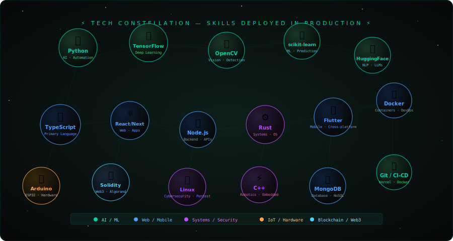

<div align="center">

<!-- CINEMATIC HERO -->


[](https://git.io/typing-svg)

<br/>

<a href="https://github.com/rajkrish0608"></a>
<a href="https://linkedin.com/in/rajkrish0608"></a>
<a href="mailto:rajkrish060804@gmail.com"></a>
<a href="https://github.com/rajkrish0608?tab=repositories"></a>

</div>

---

## 🌐 Project Universe — 3D Globe

> Every dot is a commit. Every color is a domain.

<div align="center">

</div>

<div align="center">

| 🟠 AI / ML | 🟢 Engineering & IoT | 🟣 Security | 🔵 Web Dev |
|:---:|:---:|:---:|:---:|
| TensorFlow · OpenCV · XGBoost | ESP32 · Arduino · MQTT | Linux · Pentest · CyberSec | React · Vue · Node.js |

</div>

---

## ⚡ Tech Stack & Capabilities

> Each bubble is a skill shipped in a real project — no fake percentage bars.

<div align="center">

</div>

<div align="center">

| Category | Technologies |
|---|---|
| 🟢 **AI / ML** | Python · TensorFlow · scikit-learn · OpenCV · XGBoost · Flask · C++ |
| 🔵 **Web** | React · Vue · Next.js · JavaScript · TypeScript · Node.js · MongoDB · HTML/CSS |
| 🟠 **Security / IoT** | ESP32 · IoT · Linux · Cybersecurity · Socket.io |
| 🟣 **Tools** | Git · GitHub · Docker · Figma · Vercel · HuggingFace |

</div>

---

## 👤 About Me

```typescript
const RajKrish = {
  pronouns:     "he/him",
  location:     "Jaipur, India 🇮🇳",
  role:         "Engineering Student",
  passions:     ["AI/ML", "IoT", "Blockchain", "Robotics", "Cybersecurity"],

  currentFocus: [
    "🌱 React, Vue & GSAP animations",
    "🤖 AI-driven IoT edge systems",
    "⛓️  Blockchain smart contracts",
    "🔐 Smart security automation"
  ],

  philosophy:   "Build with purpose. Code with soul.",
  contact:      "rajkrish060804@gmail.com",
  openTo:       ["Collaborations", "Internships", "Open Source"],
};
```

---

## 🏆 GitHub Trophies

<div align="center">

</div>

---

## 📊 GitHub Stats

<div align="center">


&nbsp;


<br/><br/>


</div>

---

## 🌊 Contribution Wave

<div align="center">

</div>

---

## 🚀 Pinned Projects

<div align="center">

<a href="https://github.com/rajkrish0608/commit_01">
  
</a>

</div>

> 🔭 More projects shipping soon — building in public, one commit at a time.

---

## 🎯 2025 Mission Board

<div align="center">

| Goal | Status | Domain |
|------|--------|--------|
| 🌐 Build 3 Full-Stack Web Apps | 🔄 In Progress | React · Vue · Node |
| 🤖 Deploy AI-IoT Home System | 🔄 In Progress | ESP32 · TF · MQTT |
| ⛓️ Launch a Blockchain dApp | 📅 Planned | Solidity · Web3 |
| 🏆 5 Open Source Contributions | 📅 Planned | Python · JS |
| 🎓 Land a Top Internship | 🎯 Target | Full-Stack / AI |

</div>

---

## 🤝 Connect & Build Together

<div align="center">

<a href="https://linkedin.com/in/rajkrish0608"></a>
&nbsp;
<a href="mailto:rajkrish060804@gmail.com"></a>
&nbsp;
<a href="https://github.com/rajkrish0608"></a>
&nbsp;
<a href="https://geeksforgeeks.org/user/rajkrish0608"></a>

</div>

<br/>

<div align="center">


*"Code is poetry. Build with intention. Ship with pride."*

⭐ **Star my repos if you find them useful!** ⭐

</div>
